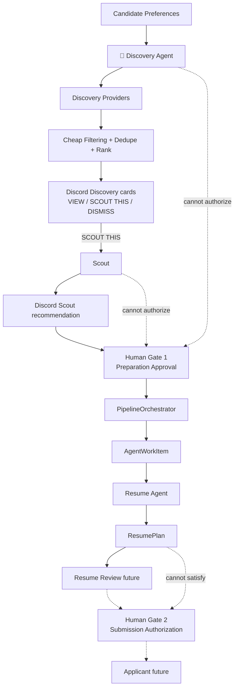

# AI Job Agent

Agentic job-application system with a hard authorization boundary: **no resume generation or application submission without explicit user approval of a specific job**.

## Purpose

Narrow agents cooperate through **persisted structured state** — not free-form inter-agent chat.

| Agent | Role | Status |
| --- | --- | --- |
| **Scout** | Evaluate jobs; recommend for human review | Implemented |
| **Resume** | Build `ResumePlan` after Gate 1 approval | Implemented (plan only) |
| **Resume Review** | Review tailored resume | Not implemented |
| **Applicant** | Submit applications | Placeholder (Gate 2 locked) |
| **Discovery** | Find jobs from preferences; light filter; Discord review | Implemented (MVP) |
| **Tracker** | Track outcomes | Not implemented |

Discord is the control room.

## Discord architecture — one bot + one webhook

```text
                 Discord
                    │
       ┌────────────┴────────────┐
       │                         │
ai-job-agent bot           Agent Webhook
CONTROL PLANE              ACTIVITY FEED
       │                         │
commands / buttons         dynamic identity
approvals                  per AgentType
/pipeline*                 (username + optional avatar)
```

| Surface | Role |
| --- | --- |
| **Bot** | Slash commands, APPROVE/REJECT, interactive components |
| **Webhook** (`DISCORD_AGENT_WEBHOOK_URL`) | Agent activity posts as Scout / Resume Agent / etc. |

Webhook usernames/avatars are **presentation identities** for real internal agents — not separate Discord applications.

Interactive Scout cards with **APPROVE** stay on the real bot. Webhook messages are activity-only (no buttons).

Treat `DISCORD_AGENT_WEBHOOK_URL` as a secret (never commit, log, or expose via `/status`).

Optional avatars: `SCOUT_AVATAR_URL`, `RESUME_AVATAR_URL`, `RESUME_REVIEW_AVATAR_URL`, `APPLICANT_AVATAR_URL`, `DISCOVERY_AVATAR_URL`, `TRACKER_AVATAR_URL`.

## Authorization — two human gates

| Gate | Meaning | Record |
| --- | --- | --- |
| **Gate 1 — Prepare** | “I want to prepare an application for this exact job.” | Existing `Approval` |
| **Gate 2 — Submit** | “I reviewed the packet — submit this exact application.” | `SubmissionAuthorization` (schema only; never auto-created) |

Preparation Approval never satisfies submission checks.

`ApprovalService.can_prepare_application(job_id)` ≠ `can_submit_application(pipeline_id)`.

## Architecture



**Discovery finds opportunities. Scout evaluates. Human approves preparation. Resume prepares. Submission stays separately locked.**

### Discovery providers (Phase 3.2)

| Provider | Auth | Why selected | Limitations |
| --- | --- | --- | --- |
| **Greenhouse Job Board API** | None | Stable public JSON; employer `absolute_url`; optional HTML content | Requires known board tokens (no global search); not every employer |
| **Remotive public API** | None | Real remote software jobs; structured JSON | Remote-only; salary often free-text |
| **Fake** | n/a | Deterministic tests | Not live |

Rejected for MVP: LinkedIn/Indeed HTML scraping, CAPTCHA bypass, brittle page scraping.

Config: `DISCOVERY_PROVIDER`, `DISCOVERY_GREENHOUSE_BOARDS`, `DISCOVERY_MAX_SURFACED_RESULTS`, etc. (see `.env.example`).

### Discovery Discord flow

1. `/discover` → creates `DiscoveryRun` + `AgentWorkItem(DISCOVERY, SEARCH_JOBS)` (no network in the slash handler)
2. Worker claims work → webhook **📡 Discovery — RUNNING**
3. Providers → filter → dedupe → rank → persist `DiscoveryResult`
4. Webhook **COMPLETE / PARTIAL / FAILED** with real counts
5. Control bot posts result cards: **VIEW JOB** · **SCOUT THIS** · **DISMISS**
6. **SCOUT THIS** reuses existing ingestion + `ScoutPipeline` (prefers provider structured content when URL fetch is blocked)
7. Gate 1 **APPROVE** remains mandatory before Resume

`/scout-test` remains for fixtures / URL / paste.

If a worker crashes leaving Discovery `RUNNING`, recover intentionally (does not reset fresh heartbeats):

```bash
python -m app.workers.recover_stale_work --older-than-minutes 5
# or force a specific item:
python -m app.workers.recover_stale_work --work-item-id 1 --older-than-minutes 0
```

`/discover` refuses a second queue while any Discovery work item is already `PENDING` or `RUNNING`.

**Domain separation**

- `Job` = opportunity (existing lifecycle statuses)
- `ApplicationPipeline` = our attempt to apply (preparation workflow status)
- `AgentWorkItem` = durable agent handoff
- `ResumePlan` = structured Resume Agent artifact (not a PDF yet)

Agents communicate via database rows and typed schemas.

## Local demo (control room)

Terminal 1:

```bash
source .venv/bin/activate
python -m app.discord.bot
```

Terminal 2:

```bash
source .venv/bin/activate
python -m app.workers.agent_worker
```

Then in Discord:

1. `/discover` → Discovery searches configured providers (worker)
2. Review Discovery cards → optional **SCOUT THIS**
3. Or `/scout-test` → evaluate a fixture/URL/paste
4. Click **APPROVE** (Gate 1 — control bot)
5. Worker claims Resume work → webhook posts as **Resume Agent — RUNNING**
6. ResumePlan persists → webhook posts as **Resume Agent — COMPLETE**
7. `/pipeline` · `/pipeline-status` · `/agents` · `/resume-plan` · `/discovery-status`

Submission remains **LOCKED**. If the webhook URL is unset, the pipeline still runs; activity posts are skipped.

## Setup

```bash
cd /Users/sam/AiProjects/ai-job-agent
python3.12 -m venv .venv
source .venv/bin/activate
pip install -r requirements.txt
cp .env.example .env
cp data/candidate_profile.example.json data/candidate_profile.json
```

API keys and the private profile belong only in gitignored local files.

## Environment variables

| Variable | Description |
| --- | --- |
| `DISCORD_BOT_TOKEN` | Bot token (control plane) |
| `DISCORD_GUILD_ID` | Fast command sync |
| `DISCORD_CHANNEL_ID` | Optional legacy channel id |
| `DISCORD_AGENT_WEBHOOK_URL` | Agent activity webhook (**secret**) |
| `DISCORD_WEBHOOK_TIMEOUT_SECONDS` | Webhook HTTP timeout (default 5) |
| `*_AVATAR_URL` | Optional per-agent avatar overrides |
| `LLM_PROVIDER` | `mock` or `openai` |
| `OPENAI_API_KEY` | Required only for openai |
| `AGENT_MAX_ATTEMPTS` | Work-item retry bound (default 3) |
| `AGENT_WORKER_POLL_SECONDS` | Worker poll interval (default 2) |
| `CANDIDATE_PROFILE_PATH` | Private profile path |

## Database / migration notes

New tables (created via `init_db()` / `create_all`):

- `application_pipelines`
- `agent_work_items`
- `resume_plans`
- `submission_authorizations`

Existing `jobs` / `approvals` rows are unchanged. Restart the bot/worker once so `create_all` adds tables to your local SQLite file. No Alembic yet — introducing Postgres later should add migrations.

SQLite worker note: prefer a **single** `agent_worker` process; claim uses conditional `UPDATE … WHERE status=PENDING` (PostgreSQL-ready).

## Tests

```bash
source .venv/bin/activate
pytest -v
```

## Current scope

### Done

- Phase 1 Discord approval control plane
- Phase 2A Scout evaluation + ingestion + evidence-grounded qualification
- Phase 2A.7 / Phase 3 foundation: orchestrator, work items, ResumePlan, worker, Discord control-room commands

### Not started (do not implement without instruction)

- Resume PDF/DOCX generation
- Resume Review Agent
- Autonomous discovery
- Playwright / form filling / submission
- Gate 2 Discord UI
- Celery / Redis / agent frameworks

STOP after orchestration + ResumePlan + Discord control room.
