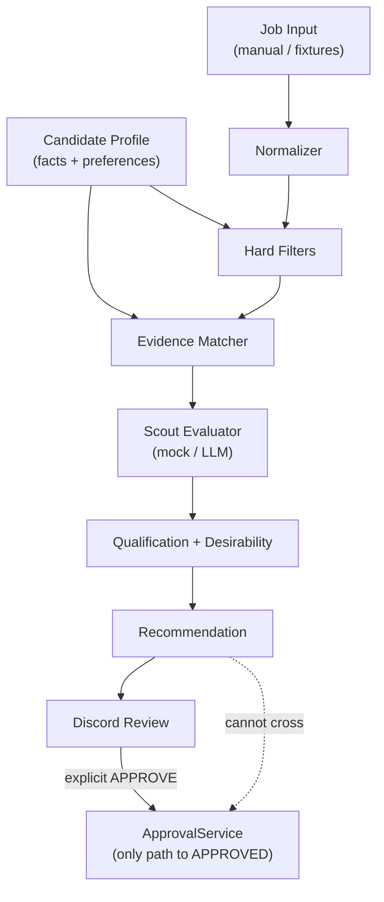

# AI Job Agent

Agentic job-application system with a hard authorization boundary: **no resume generation or application submission without explicit user approval of a specific job**.

## Purpose

Three long-term agents:

| Agent | Role |
| --- | --- |
| **Scout Agent** | Discovers jobs, scores them against your career profile, recommends strong matches |
| **Resume Agent** | After explicit approval, builds a tailored resume using only verified profile facts |
| **Application Agent** | Uses an approved job + resume to fill and submit the employer application; pauses on unknown questions |

Discord is the initial primary control interface.

## Authorization philosophy

Authorization is **deterministic application logic**, never LLM prompt trust.

1. A job enters the review queue as `AWAITING_APPROVAL`.
2. Only an explicit Discord **APPROVE** button/command may authorize it.
3. Conversational comments never count as approval.
4. Approval creates a persisted `Approval` row proving: *User X explicitly approved Job Y at Time Z*.
5. `ApprovalService.can_enter_application_pipeline(job_id)` returns true only when:
   - the job is in an approved/post-approval status, **and**
   - a valid `Approval` record exists for that **exact** `job_id`
6. `AWAITING_APPROVAL → APPROVED` is allowed **only** through `ApprovalService`. Resume and Applicant agents cannot approve jobs.

Invariant: **NO APPLICATION WITHOUT EXPLICIT USER APPROVAL.**

Scout recommendations never authorize anything.

## Architecture



### Phase 2A concepts

| Concept | Meaning |
| --- | --- |
| **Candidate facts** | Verified employers, titles, dates, education, skills, certifications, projects |
| **Candidate preferences** | What the user wants next (roles, salary, remote, location, dealbreakers) |
| **Qualification score** | How well the candidate matches what the employer wants (0–100) |
| **Desirability score** | How well the job matches *known* candidate preferences (0–100) |
| **Hard filters** | Deterministic dealbreakers before LLM judgment |
| **LLM judgment** | Nuanced evaluation only after structured filtering/matching |
| **Authorization** | Completely separate — human APPROVE only |

Unknown preferences must **not** penalize or hard-reject a job.

A skill listed on a résumé does **not** prove years, proficiency, or production depth.

See [docs/FACTUAL_INTEGRITY.md](docs/FACTUAL_INTEGRITY.md).

### Job state machine

```
DISCOVERED → SCORED → RECOMMENDED → AWAITING_APPROVAL
                                         ├─→ APPROVED → GENERATING_RESUME → RESUME_READY
                                         │                  → READY_TO_APPLY → APPLYING
                                         │                       ├─→ APPLIED
                                         │                       ├─→ NEEDS_USER
                                         │                       └─→ FAILED
                                         └─→ REJECTED → ARCHIVED
```

## Project layout

```
app/
  schemas/             # Pydantic domain schemas (candidate, job, evaluation)
  agents/scout/        # Pipeline, hard filters, evidence, mock LLM, CLI
  discord/             # bot, views, embeds
  models/              # Job, Approval, Application, ScoutEvaluationRecord
  services/            # JobService, ApprovalService, ScoutEvaluationService
data/
  candidate_profile.example.json   # sanitized schema example (committed)
  candidate_profile.json           # private local profile (gitignored)
  fixtures/scout/                  # manual job fixtures for Scout tests
docs/FACTUAL_INTEGRITY.md
tests/
```

## Setup

```bash
cd /Users/sam/AiProjects/ai-job-agent
python3.12 -m venv .venv
source .venv/bin/activate
pip install -r requirements.txt
cp .env.example .env
cp data/candidate_profile.example.json data/candidate_profile.json
# Edit .env and fill verified facts into candidate_profile.json
```

## Environment variables

| Variable | Required | Description |
| --- | --- | --- |
| `DISCORD_BOT_TOKEN` | Yes (for bot) | Discord bot token |
| `DISCORD_GUILD_ID` | Recommended | Guild ID for fast slash-command sync |
| `DISCORD_CHANNEL_ID` | Optional | Channel for future job notifications |
| `APP_ENV` | No | `development` (default) |
| `DATABASE_URL` | No | Default `sqlite:///./data/ai_job_agent.db` |
| `ENABLE_TEST_COMMANDS` | No | Enables `/testjob` and `/scout-test` (default `true`) |
| `CANDIDATE_PROFILE_PATH` | No | Default `./data/candidate_profile.json` |
| `API_HOST` / `API_PORT` | No | FastAPI bind defaults |
| `LLM_PROVIDER` | No | `mock` (default) or `openai` |
| `LLM_MODEL` | No | Model name when using a paid provider |
| `OPENAI_API_KEY` | No | Only if `LLM_PROVIDER=openai` |
| `SCOUT_EVALUATOR_VERSION` | No | Default `2a.1` |
| `SCOUT_MIN_QUALIFICATION_SCORE` | No | Default `55` |
| `SCOUT_MIN_DESIRABILITY_SCORE` | No | Default `50` |
| `SCOUT_STRONG_QUALIFICATION_SCORE` | No | Default `80` |
| `SCOUT_STRONG_DESIRABILITY_SCORE` | No | Default `75` |

## Running locally

### API

```bash
source .venv/bin/activate
python -m app.main
```

### Discord bot

```bash
source .venv/bin/activate
python -m app.discord.bot
```

Slash commands:

| Command | Purpose |
| --- | --- |
| `/status` | Basic system status |
| `/jobs` | Jobs awaiting approval |
| `/testjob` | Dev-only: insert a fake recommendation |
| `/scout-test` | Dev-only: evaluate a Scout fixture and show scores |

### Scout test harness (CLI)

```bash
source .venv/bin/activate

# Strong backend match
python -m app.agents.scout.evaluate_job data/fixtures/scout/fixture_a_strong_backend.json

# High qualification / low desirability (uses remote-required test profile)
python -m app.agents.scout.evaluate_job data/fixtures/scout/fixture_c_onsite_undesirable.json \
  --profile data/fixtures/profiles/test_remote_required.json

# Missing salary/remote info
python -m app.agents.scout.evaluate_job data/fixtures/scout/fixture_d_missing_info.json

# Persist evaluation (still requires Discord APPROVE to authorize)
python -m app.agents.scout.evaluate_job data/fixtures/scout/fixture_a_strong_backend.json --persist
```

## Tests

```bash
source .venv/bin/activate
pytest -v
```

## Current scope

### Phase 1 (complete)

- Discord control plane + approval boundary
- Job state machine
- Agent placeholders with authorization checks

### Phase 2A (this iteration)

- Candidate profile schema + private local profile
- Preferences schema with UNKNOWN-safe semantics
- Normalized job + Scout evaluation schemas
- Hard filters, skill aliases, evidence matching
- Qualification vs desirability scoring
- Mock LLM evaluator + optional OpenAI abstraction
- Scout evaluation persistence
- CLI + `/scout-test` harness
- Fixtures A–F

### Not started

- Autonomous job-board discovery / scraping
- Playwright / application submission
- Resume generation
- Feedback-learning algorithms

Do not begin Phase 2B (autonomous discovery) without explicit approval.
