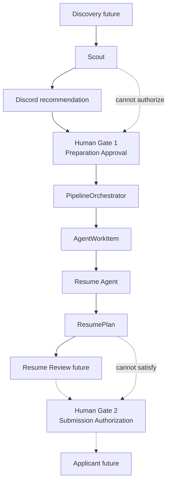

# AI Job Agent

Agentic job-application system with a hard authorization boundary: **no resume generation or application submission without explicit user approval of a specific job**.

## Purpose

Narrow agents cooperate through **persisted structured state** — not free-form inter-agent chat.

| Agent | Role | Status |
| --- | --- | --- |
| **Scout** | Evaluate jobs; recommend for human review | Implemented |
| **Resume** | Build `ResumePlan` after Gate 1 approval | Implemented (plan only) |
| **Resume Review** | Review tailored resume | Not implemented |
| **Applicant** | Submit applications | Placeholder (Gate 2 locked) |
| **Discovery** | Find jobs | Not implemented |
| **Tracker** | Track outcomes | Not implemented |

Discord is the control room.

## Authorization — two human gates

| Gate | Meaning | Record |
| --- | --- | --- |
| **Gate 1 — Prepare** | “I want to prepare an application for this exact job.” | Existing `Approval` |
| **Gate 2 — Submit** | “I reviewed the packet — submit this exact application.” | `SubmissionAuthorization` (schema only; never auto-created) |

Preparation Approval never satisfies submission checks.

`ApprovalService.can_prepare_application(job_id)` ≠ `can_submit_application(pipeline_id)`.

## Architecture



**Domain separation**

- `Job` = opportunity (existing lifecycle statuses)
- `ApplicationPipeline` = our attempt to apply (preparation workflow status)
- `AgentWorkItem` = durable agent handoff
- `ResumePlan` = structured Resume Agent artifact (not a PDF yet)

Agents communicate via database rows and typed schemas.

## Local demo (control room)

Terminal 1:

```bash
source .venv/bin/activate
python -m app.discord.bot
```

Terminal 2:

```bash
source .venv/bin/activate
python -m app.workers.agent_worker
```

Then in Discord:

1. `/scout-test` → evaluate a job
2. Click **APPROVE** (Gate 1)
3. See preparation approved + Resume Agent queued
4. Worker claims work → ResumePlan persisted
5. `/pipeline` · `/pipeline-status` · `/agents` · `/resume-plan`

Submission remains **LOCKED**.

## Setup

```bash
cd /Users/sam/AiProjects/ai-job-agent
python3.12 -m venv .venv
source .venv/bin/activate
pip install -r requirements.txt
cp .env.example .env
cp data/candidate_profile.example.json data/candidate_profile.json
```

API keys and the private profile belong only in gitignored local files.

## Environment variables

| Variable | Description |
| --- | --- |
| `DISCORD_BOT_TOKEN` | Bot token |
| `DISCORD_GUILD_ID` | Fast command sync |
| `DISCORD_CHANNEL_ID` | Agent activity notifications (optional; pipeline still works if unset) |
| `LLM_PROVIDER` | `mock` or `openai` |
| `OPENAI_API_KEY` | Required only for openai |
| `AGENT_MAX_ATTEMPTS` | Work-item retry bound (default 3) |
| `AGENT_WORKER_POLL_SECONDS` | Worker poll interval (default 2) |
| `CANDIDATE_PROFILE_PATH` | Private profile path |

## Database / migration notes

New tables (created via `init_db()` / `create_all`):

- `application_pipelines`
- `agent_work_items`
- `resume_plans`
- `submission_authorizations`

Existing `jobs` / `approvals` rows are unchanged. Restart the bot/worker once so `create_all` adds tables to your local SQLite file. No Alembic yet — introducing Postgres later should add migrations.

SQLite worker note: prefer a **single** `agent_worker` process; claim uses conditional `UPDATE … WHERE status=PENDING` (PostgreSQL-ready).

## Tests

```bash
source .venv/bin/activate
pytest -v
```

## Current scope

### Done

- Phase 1 Discord approval control plane
- Phase 2A Scout evaluation + ingestion + evidence-grounded qualification
- Phase 2A.7 / Phase 3 foundation: orchestrator, work items, ResumePlan, worker, Discord control-room commands

### Not started (do not implement without instruction)

- Resume PDF/DOCX generation
- Resume Review Agent
- Autonomous discovery
- Playwright / form filling / submission
- Gate 2 Discord UI
- Celery / Redis / agent frameworks

STOP after orchestration + ResumePlan + Discord control room.
