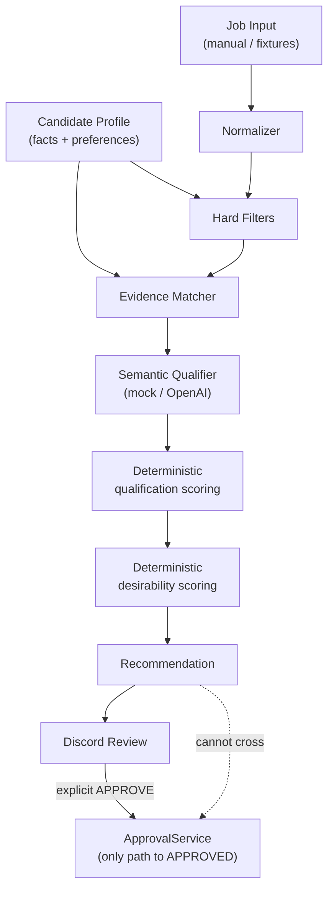

# AI Job Agent

Agentic job-application system with a hard authorization boundary: **no resume generation or application submission without explicit user approval of a specific job**.

## Purpose

Three long-term agents:

| Agent | Role |
| --- | --- |
| **Scout Agent** | Discovers jobs, scores them against your career profile, recommends strong matches |
| **Resume Agent** | After explicit approval, builds a tailored resume using only verified profile facts |
| **Application Agent** | Uses an approved job + resume to fill and submit the employer application; pauses on unknown questions |

Discord is the initial primary control interface.

## Authorization philosophy

Authorization is **deterministic application logic**, never LLM prompt trust.

1. A job enters the review queue as `AWAITING_APPROVAL`.
2. Only an explicit Discord **APPROVE** button/command may authorize it.
3. Conversational comments never count as approval.
4. Approval creates a persisted `Approval` row proving: *User X explicitly approved Job Y at Time Z*.
5. `ApprovalService.can_enter_application_pipeline(job_id)` returns true only when:
   - the job is in an approved/post-approval status, **and**
   - a valid `Approval` record exists for that **exact** `job_id`
6. `AWAITING_APPROVAL → APPROVED` is allowed **only** through `ApprovalService`. Resume and Applicant agents cannot approve jobs.

Invariant: **NO APPLICATION WITHOUT EXPLICIT USER APPROVAL.**

Scout recommendations never authorize anything. Perfect qualification scores do not authorize anything.

## Architecture



### Deterministic responsibilities (code)

- Hard filters (including salary minimum)
- Preference / desirability scoring
- Aggregation of requirement matches → qualification score
- Authorization and approval state
- Persistence rules
- Confidence capping for partial / low-extraction content

### LLM responsibilities (advisory)

- Understand job requirements semantically
- Distinguish required / preferred / contextual mentions
- Compare requirements to **verified** candidate evidence
- Classify evidence strength and match level
- Identify transferable experience and gaps
- Explain qualification (not desire, not approval)

### LLM must never

- Invent candidate facts, years, employers, or proficiency
- Change hard filters
- Approve jobs or create `Approval` records
- Submit applications
- Override `ApprovalService`
- Silently alter preferences or substitute mock when OpenAI fails

See [docs/FACTUAL_INTEGRITY.md](docs/FACTUAL_INTEGRITY.md).

### Job state machine

```
DISCOVERED → SCORED → RECOMMENDED → AWAITING_APPROVAL
                                         ├─→ APPROVED → GENERATING_RESUME → RESUME_READY
                                         │                  → READY_TO_APPLY → APPLYING
                                         │                       ├─→ APPLIED
                                         │                       ├─→ NEEDS_USER
                                         │                       └─→ FAILED
                                         └─→ REJECTED → ARCHIVED
```

## Project layout

```
app/
  schemas/             # Pydantic domain schemas (candidate, job, evaluation, qualification)
  agents/scout/        # Pipeline, hard filters, evidence, LLM clients, prompts, CLI
  discord/             # bot, views, embeds
  models/              # Job, Approval, Application, ScoutEvaluationRecord
  services/            # JobService, ApprovalService, ScoutEvaluationService
data/
  candidate_profile.example.json   # sanitized schema example (committed)
  candidate_profile.json           # private local profile (gitignored)
  fixtures/scout/                  # manual job fixtures for Scout tests
docs/FACTUAL_INTEGRITY.md
tests/
```

## Setup

```bash
cd /Users/sam/AiProjects/ai-job-agent
python3.12 -m venv .venv
source .venv/bin/activate
pip install -r requirements.txt
cp .env.example .env
cp data/candidate_profile.example.json data/candidate_profile.json
# Edit .env and fill verified facts into candidate_profile.json
```

API keys belong **only** in `.env` (gitignored). Never commit keys or `data/candidate_profile.json`.

## Environment variables

| Variable | Required | Description |
| --- | --- | --- |
| `DISCORD_BOT_TOKEN` | Yes (for bot) | Discord bot token |
| `DISCORD_GUILD_ID` | Recommended | Guild ID for fast slash-command sync |
| `DISCORD_CHANNEL_ID` | Optional | Channel for future job notifications |
| `APP_ENV` | No | `development` (default) |
| `DATABASE_URL` | No | Default `sqlite:///./data/ai_job_agent.db` |
| `ENABLE_TEST_COMMANDS` | No | Enables `/testjob` and `/scout-test` (default `true`) |
| `CANDIDATE_PROFILE_PATH` | No | Default `./data/candidate_profile.json` |
| `API_HOST` / `API_PORT` | No | FastAPI bind defaults |
| `LLM_PROVIDER` | No | `mock` (default) or `openai` |
| `LLM_MODEL` | No | Default `gpt-4o-mini` when using OpenAI |
| `LLM_TEMPERATURE` | No | Default `0.1` |
| `OPENAI_API_KEY` | If openai | Required when `LLM_PROVIDER=openai` — fail-clear, no silent mock |
| `LLM_FAILURE_FALLBACK` | No | `none` (default). Do not silently fall back to mock |
| `SCOUT_PROMPT_VERSION` | No | Default `qualification-v1` |
| `SCOUT_EVALUATOR_VERSION` | No | Default `2a.6` |
| `SCOUT_MIN_QUALIFICATION_SCORE` | No | Default `55` |
| `SCOUT_MIN_DESIRABILITY_SCORE` | No | Default `50` |
| `SCOUT_STRONG_QUALIFICATION_SCORE` | No | Default `80` |
| `SCOUT_STRONG_DESIRABILITY_SCORE` | No | Default `75` |

### Switching evaluators

**Mock (deterministic, free):**

```bash
# .env
LLM_PROVIDER=mock
```

```bash
python -m app.agents.scout.evaluate --fixture g_calibration_se --provider mock
```

**OpenAI (structured qualification analysis):**

```bash
# .env
LLM_PROVIDER=openai
OPENAI_API_KEY=YOUR_OPENAI_API_KEY_HERE
LLM_MODEL=gpt-4o-mini
SCOUT_PROMPT_VERSION=qualification-v1
```

```bash
python -m app.agents.scout.evaluate --fixture g_calibration_se --provider openai
```

`--provider` overrides for one run only; it does not rewrite `.env`.

If `LLM_PROVIDER=openai` and `OPENAI_API_KEY` is missing, Scout **fails clearly** and does **not** secretly use mock.

### Compare mock vs OpenAI

```bash
python -m app.agents.scout.compare --fixture g_calibration_se --providers mock,openai
```

## Running locally

### API

```bash
source .venv/bin/activate
python -m app.main
```

### Discord bot

```bash
source .venv/bin/activate
python -m app.discord.bot
```

Slash commands:

| Command | Purpose |
| --- | --- |
| `/status` | Basic system status |
| `/jobs` | Jobs awaiting approval |
| `/testjob` | Dev-only: insert a fake recommendation |
| `/scout-test` | Dev-only: evaluate a fixture, URL, or pasted job |
| `/scout-detail` | Requirement-level analysis for an already evaluated job |

### Scout test harness (CLI)

```bash
source .venv/bin/activate

# Fixture
python -m app.agents.scout.evaluate --fixture a_strong_backend
python -m app.agents.scout.evaluate --fixture g_calibration_se

# Pasted / file job description
python -m app.agents.scout.evaluate --file ./job_description.txt --provider mock

# Public job URL (SSRF-protected fetch)
python -m app.agents.scout.evaluate --url "https://example.com/jobs/123"

# Persist evaluation (still requires Discord APPROVE to authorize)
python -m app.agents.scout.evaluate --fixture a_strong_backend --persist
```

Discord `/scout-test` opens buttons for **TEST FIXTURE**, **JOB URL**, and **PASTE JOB**. Paste is limited to Discord's 4000-character modal cap — use the CLI for longer postings.

## Tests

```bash
source .venv/bin/activate
pytest -v
```

No test calls a real paid API. OpenAI is mocked.

## Current scope

### Phase 1 (complete)

- Discord control plane + approval boundary
- Job state machine
- Agent placeholders with authorization checks

### Phase 2A–2A.5 (complete)

- Candidate profile + preferences
- Hard filters, evidence matching, desirability
- Manual fixture / URL / paste ingestion
- Discord Scout cards

### Phase 2A.6 (this iteration)

- Evidence-grounded semantic qualification (mock + OpenAI)
- Structured requirement matches + deterministic score aggregation
- Privacy-minimized LLM candidate payload
- Prompt versioning + token usage metadata + evaluation fingerprint
- Provider CLI override + compare utility
- Calibration fixture `g_calibration_se`

### Not started

- Autonomous job-board discovery / scraping
- Playwright / application submission
- Resume generation
- Feedback-learning algorithms
- Multi-model routing / evaluation cache hit path

Do not begin autonomous discovery without explicit approval. Next step is **human calibration** of Scout judgments.
