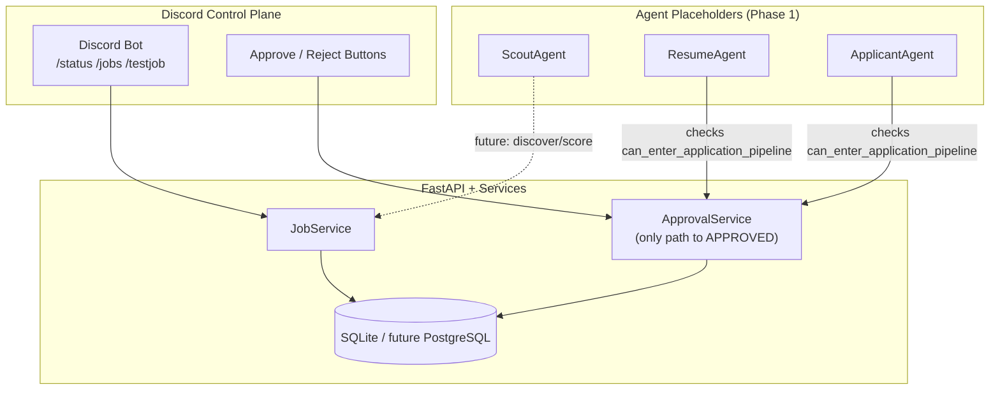

# AI Job Agent

Agentic job-application system with a hard authorization boundary: **no resume generation or application submission without explicit user approval of a specific job**.

Phase 1 (this repository state) delivers the project foundation and Discord control plane only. It does **not** search real job boards, call LLMs, generate resumes, or automate browsers.

## Purpose

Three long-term agents:

| Agent | Role |
| --- | --- |
| **Scout Agent** | Discovers jobs, scores them against your career profile, recommends strong matches |
| **Resume Agent** | After explicit approval, builds a tailored resume using only verified profile facts |
| **Application Agent** | Uses an approved job + resume to fill and submit the employer application; pauses on unknown questions |

Discord is the initial primary control interface.

## Authorization philosophy

Authorization is **deterministic application logic**, never LLM prompt trust.

1. A job enters the review queue as `AWAITING_APPROVAL`.
2. Only an explicit Discord **APPROVE** button/command may authorize it.
3. Conversational comments never count as approval.
4. Approval creates a persisted `Approval` row proving: *User X explicitly approved Job Y at Time Z*.
5. `ApprovalService.can_enter_application_pipeline(job_id)` returns true only when:
   - the job is in an approved/post-approval status, **and**
   - a valid `Approval` record exists for that **exact** `job_id`
6. `AWAITING_APPROVAL → APPROVED` is allowed **only** through `ApprovalService`. Resume and Applicant agents cannot approve jobs.

Invariant: **NO APPLICATION WITHOUT EXPLICIT USER APPROVAL.**

## Architecture



### Job state machine

```
DISCOVERED → SCORED → RECOMMENDED → AWAITING_APPROVAL
                                         ├─→ APPROVED → GENERATING_RESUME → RESUME_READY
                                         │                  → READY_TO_APPLY → APPLYING
                                         │                       ├─→ APPLIED
                                         │                       ├─→ NEEDS_USER
                                         │                       └─→ FAILED
                                         └─→ REJECTED → ARCHIVED
```

`REJECTED` has no path back to `APPROVED` without an explicit future recovery mechanism.

## Project layout

```
app/
  main.py              # FastAPI app
  config.py            # pydantic-settings / dotenv
  agents/              # Scout, Resume, Applicant placeholders
  discord/             # bot, views, embeds
  models/              # Job, Approval, Application
  services/            # JobService, ApprovalService
  database/            # SQLAlchemy engine/session
data/
  candidate_profile.example.json
  application_answers.example.json
tests/
```

## Setup

```bash
cd /Users/sam/AiProjects/ai-job-agent
python3.12 -m venv .venv
source .venv/bin/activate
pip install -r requirements.txt
cp .env.example .env
# Edit .env with your Discord credentials
```

## Environment variables

| Variable | Required | Description |
| --- | --- | --- |
| `DISCORD_BOT_TOKEN` | Yes (for bot) | Discord bot token |
| `DISCORD_GUILD_ID` | Recommended | Guild ID for fast slash-command sync |
| `DISCORD_CHANNEL_ID` | Optional | Channel for future job notifications |
| `APP_ENV` | No | `development` (default) |
| `DATABASE_URL` | No | Default `sqlite:///./data/ai_job_agent.db` |
| `ENABLE_TEST_COMMANDS` | No | Enables `/testjob` (default `true`) |
| `API_HOST` | No | Default `127.0.0.1` |
| `API_PORT` | No | Default `8000` |

## Running locally

### API

```bash
source .venv/bin/activate
python -m app.main
# or: uvicorn app.main:app --reload --host 127.0.0.1 --port 8000
```

Health check: `GET http://127.0.0.1:8000/health`

### Discord bot

1. Create a Discord application + bot at https://discord.com/developers/applications
2. Enable needed OAuth scopes (`bot`, `applications.commands`) and invite the bot to your server
3. Set `DISCORD_BOT_TOKEN` and `DISCORD_GUILD_ID` in `.env`
4. Run:

```bash
source .venv/bin/activate
python -m app.discord.bot
```

Slash commands:

| Command | Purpose |
| --- | --- |
| `/status` | Basic system status |
| `/jobs` | Jobs awaiting approval |
| `/testjob` | Dev-only: insert a fake recommendation and post Approve/Reject buttons |

**APPROVE** persists an `Approval` record, transitions `AWAITING_APPROVAL → APPROVED`, updates the embed, and disables action buttons. **REJECT** transitions to `REJECTED` and disables buttons.

## Tests

```bash
source .venv/bin/activate
pytest -v
```

Coverage focuses on the state machine and approval boundary (unapproved / recommended / cross-job / duplicate / rejected cases).

## Candidate profile & application answers

- `data/candidate_profile.example.json` — future authoritative career facts for the Resume Agent.
  - **Rule:** the Resume Agent may select, reorder, summarize, and rephrase verified facts, but may **never invent** skills, experience, employers, dates, certifications, education, metrics, or accomplishments.
- `data/application_answers.example.json` — recurring application fields (work auth, sponsorship, relocation, arrangement). No demographic/sensitive answers. Unknown questions must eventually yield `NEEDS_USER`, not guesses.

## Current Phase 1 scope

- Project structure and configuration
- SQLAlchemy models + SQLite (PostgreSQL-ready URL)
- Validated job state machine
- Persistent approval records + `can_enter_application_pipeline`
- Discord bot control plane (`/status`, `/jobs`, `/testjob`, Approve/Reject)
- Agent placeholders with authorization checks
- Example profile/answers JSON
- pytest suite for the approval invariant

## Future phases (not started)

- **Phase 2:** Scout Agent real discovery + scoring
- **Phase 3:** Resume Agent (verified-facts-only generation)
- **Phase 4:** Applicant Agent (browser automation, `NEEDS_USER` pauses)
- PostgreSQL in production, richer audit trails, recovery path for rejected jobs (only if explicitly designed)

Do not begin Phase 2 without explicit approval.
